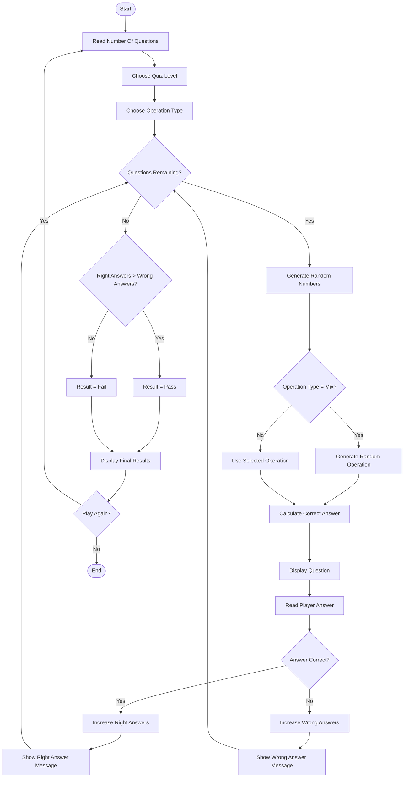

# 🎮 Math Quiz Game - Flowchart

```mermaid
flowchart TD

    A([Start]) --> B[Read Number Of Questions]
    B --> C[Choose Quiz Level]
    C --> D[Choose Operation Type]

    D --> E{Questions Remaining?}

    E -- Yes --> F[Generate Random Numbers]
    F --> G{Operation Type = Mix?}

    G -- Yes --> H[Generate Random Operation]
    G -- No --> I[Use Selected Operation]

    H --> J[Calculate Correct Answer]
    I --> J

    J --> K[Display Question]
    K --> L[Read Player Answer]

    L --> M{Answer Correct?}

    M -- Yes --> N[Increase Right Answers]
    M -- No --> O[Increase Wrong Answers]

    N --> P[Show Right Answer Message]
    O --> Q[Show Wrong Answer Message]

    P --> E
    Q --> E

    E -- No --> R{Right Answers > Wrong Answers?}

    R -- Yes --> S[Result = Pass]
    R -- No --> T[Result = Fail]

    S --> U[Display Final Results]
    T --> U

    U --> V{Play Again?}

    V -- Yes --> B
    V -- No --> W([End])
```
