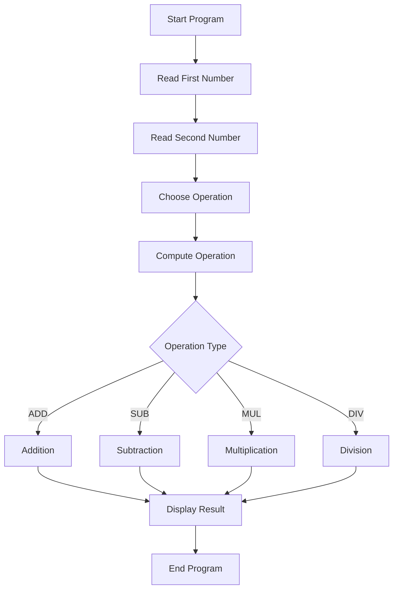

```mermaid
flowchart TD

A[Start Program] --> B[Read First Number]
B --> C[Read Second Number]
C --> D[Choose Operation]

D --> E[Compute Operation]

E --> F{Operation Type}

F -->|ADD| G[Addition]
F -->|SUB| H[Subtraction]
F -->|MUL| I[Multiplication]
F -->|DIV| J[Division]

G --> K[Display Result]
H --> K
I --> K
J --> K

K --> L[End Program]
```
